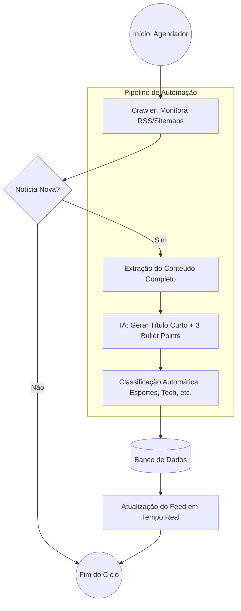

# Insight-News
# Sobre o Projeto: Vivemos em uma sociedade onde a informação é constante e rápida. Saber compreender e resumir notícias é essencial para se manter informado de forma eficiente, além de desenvolver o pensamento crítico e a capacidade de comunicação.
**Projeto:RESUMO DE NOTÍCIAS
**Problema que resolve:** [A dificuldade de filtrar e resumir o grande volume de notícias do RSS e Reddit de forma eficiente]
## Integrantes
| Nome | GitHub |
|------|--------|
| [Henrique bortolo] | [@henrique19vls] |
| [Davi Bandin] | [@davibandin] |
| [Pedro Beirigo] | [@marquesphb13-collab] |

## Arquitetura

